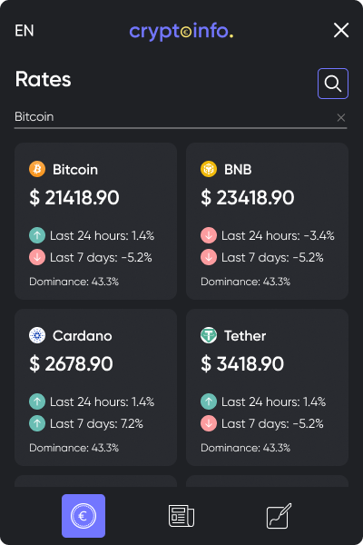

# crypto-info-extension
```About extension```
Extension which help you keep in touch with crypto industry:
1) You can see rates of coins
2) Read last news about industry
3) Add notes in order to not forget something important
###
```Pictures of extension```
1) Coins rates page 



###
2) News page 


###
3) Notes page


## Project setup
```npm install```

### Compiles and hot-reloads for development
```npm run serve```

### Compiles and minifies for production
```npm run build```

### Lints and fixes files
```npm run lint```

### Customize configuration
See [Configuration Reference](https://cli.vuejs.org/config/).
